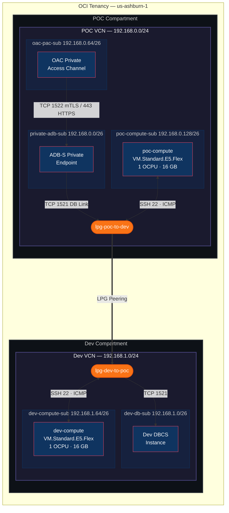

# OAC Private Endpoint ADB-S Connectivity — Terraform

Infrastructure-as-Code for OCI dual-VCN topology with LPG peering, compute instances, and automated connectivity validation.

## Architecture



### Network Topology

```
 ┌─────────────────────────────────────────────────────────────────────┐
 │  POC Compartment                                                    │
 │  ┌───────────────────────────────────────────────────────────────┐  │
 │  │  POC VCN  192.168.0.0/24                                      │  │
 │  │                                                               │  │
 │  │  ┌─────────────────┐  ┌─────────────────┐  ┌──────────────┐   │  │
 │  │  │ oac-pac-sub     │  │ private-adb-sub │  │ poc-compute  │   │  │
 │  │  │ .64/26          │─▶│ .0/26           │  │ -sub .128/26 │   │  │
 │  │  │ OAC PAC         │  │ ADB-S PE        │  │ poc-compute  │   │  │
 │  │  │ sl-oac-pac      │  │ sl-adb-private  │  │ sl-poc-comp  │   │  │
 │  │  │ nsg-oac-pac     │  │ nsg-adb-private │  │              │   │  │
 │  │  └─────────────────┘  └────────┬────────┘  └──────┬───────┘   │  │
 │  │                                │                   │          │  │
 │  │                       ┌────────┴───────────────────┴───────┐  │  │
 │  │                       │       lpg-poc-to-dev               │  │  │
 │  │                       └────────────────┬───────────────────┘  │  │
 │  └────────────────────────────────────────┼──────────────────────┘  │
 └───────────────────────────────────────────┼─────────────────────────┘
                                             │ LPG Peering (PEERED)
 ┌───────────────────────────────────────────┼─────────────────────────┐
 │  Dev Compartment                          │                         │
 │  ┌────────────────────────────────────────┼──────────────────────┐  │
 │  │  Dev VCN  192.168.1.0/24             │                        │  │
 │  │                       ┌────────────────┴───────────────────┐  │  │
 │  │                       │       lpg-dev-to-poc               │  │  │
 │  │                       └────────┬───────────────────┬───────┘  │  │
 │  │                                │                   │          │  │
 │  │  ┌─────────────────────────────┴──┐  ┌─────────────┴───────┐  │  │
 │  │  │ dev-db-sub                     │  │ dev-compute-sub     │  │  │
 │  │  │ 192.168.1.0/26              │  │ 192.168.1.64/26        │  │  │
 │  │  │ Dev DBCS                       │  │ dev-compute         │  │  │
 │  │  │ sl-dev-db                      │  │ sl-dev-compute      │  │  │
 │  │  └────────────────────────────────┘  └─────────────────────┘  │  │
 │  └───────────────────────────────────────────────────────────────┘  │
 └─────────────────────────────────────────────────────────────────────┘
```

## Traffic Flows

| Source | Destination | Protocol / Port | Path | Purpose |
|--------|-------------|-----------------|------|---------|
| OAC (PAC) | ADB-S PE | TCP 1522 | Intra-VCN | Analytics queries (mTLS) |
| OAC (PAC) | ADB-S PE | TCP 443 | Intra-VCN | REST API / HTTPS |
| ADB-S PE | Dev DBCS | TCP 1521 | LPG | DB Link / data pipeline |
| poc-compute | dev-compute | ICMP / SSH 22 | LPG | Cross-VCN connectivity validation |
| dev-compute | poc-compute | ICMP / SSH 22 | LPG | Cross-VCN connectivity validation |

## Security Controls

| Security List | Subnet | Ingress | Egress |
|---------------|--------|---------|--------|
| sl-oac-pac | oac-pac-sub | ADB return traffic | TCP 1522/443 → ADB subnet |
| sl-adb-private | private-adb-sub | TCP 1522/443 from OAC PAC | TCP 1521 → Dev DBCS, return to OAC |
| sl-dev-db | dev-db-sub | TCP 1521 from ADB-S, SSH from POC | Return to POC VCN |
| sl-poc-compute | poc-compute-sub | SSH + ICMP from both VCNs | All to both VCNs |
| sl-dev-compute | dev-compute-sub | SSH + ICMP from both VCNs | All to both VCNs |

NSGs provide additional per-VNIC control: **nsg-adb-private** (ADB-S endpoint) and **nsg-oac-pac** (OAC PAC).

## Project Structure

```
terraform-oac-adb-private/
├── provider.tf                    # OCI provider + version constraints
├── variables.tf                   # All configurable parameters
├── main.tf                        # Module composition + dependency ordering
├── outputs.tf                     # Consolidated outputs
├── terraform.tfvars               # Environment-specific OCIDs
├── .gitignore
├── README.md
├── docs/
│   └── architecture.mmd           # Mermaid source (standalone)
├── scripts/
│   └── validate_ping.py           # LPG connectivity validator (OCI SDK)
└── modules/
    ├── iam/                       # IAM policies for networking + compute
    │   ├── main.tf
    │   ├── variables.tf
    │   └── outputs.tf
    ├── networking/                 # VCNs, LPGs, subnets, security lists, NSGs, routes
    │   ├── main.tf
    │   ├── variables.tf
    │   └── outputs.tf
    └── compute/                   # Compute instances + SSH key + LPG validation
        ├── main.tf
        ├── variables.tf
        └── outputs.tf
```

## Prerequisites

1. **OCI CLI configured** with API key or instance principal authentication
2. **Terraform >= 1.5.0** installed
3. **OCI Provider >= 5.30.0** (automatically fetched)
4. **Python 3 + OCI SDK** for connectivity validation (`pip install oci`)
5. **Tenancy Limits**: minimum 2 VCNs, 1 LPG pair, 2 compute instances

## Quick Start

### 1. Compartment Requirements

This project deploys resources across **two separate OCI compartments**. Both must exist before running Terraform.

| Compartment | Variable | Resources Deployed |
|-------------|----------|--------------------|
| **POC** | `poc_compartment_ocid` | POC VCN, OAC Private Access Channel subnet, ADB-S private endpoint subnet, POC compute instance |
| **Dev** | `dev_compartment_ocid` | Dev VCN, Dev DBCS subnet, Dev compute instance |

The deploying user (or group specified by `admin_group_name`) must have the following permissions:

- **POC Compartment** — `manage virtual-network-family`, `manage instance-family`, `manage volume-family`
- **Dev Compartment** — `manage virtual-network-family`, `manage instance-family`, `manage volume-family`
- **Tenancy** — `inspect compartments`, `read app-catalog-listing`, `read instance-images`, `read instance-family`, `use volume-family`

> Terraform creates these IAM policies automatically via the `iam` module. The user running `terraform apply` must have permission to create policies at the tenancy level.

### 2. Configure Variables

```bash
cd terraform-oac-adb-private
cp terraform.tfvars.example terraform.tfvars
```

Edit `terraform.tfvars` with your environment-specific values:

```hcl
# Required
tenancy_ocid         = "ocid1.tenancy.oc1..aaaa..."
user_ocid            = "ocid1.user.oc1..aaaa..."
fingerprint          = "aa:bb:cc:dd:ee:ff:00:11:22:33:44:55:66:77:88:99"
private_key_path     = "~/.oci/oci_api_key.pem"
region               = "us-ashburn-1"

poc_compartment_ocid = "ocid1.compartment.oc1..aaaa..."
dev_compartment_ocid = "ocid1.compartment.oc1..aaaa..."
instance_image_ocid  = "ocid1.image.oc1.iad.aaaa..."
```

### 3. Deploy

```bash
terraform init
terraform plan -out=tfplan
terraform apply tfplan
```

## Connectivity Validation

After `terraform apply`, the compute module automatically runs `validate_ping.py` which checks:

1. **LPG Peering Status** — confirms `PEERED` state
2. **POC Compute Routes** — verifies route to Dev VCN via LPG
3. **Dev Compute Routes** — verifies route to POC VCN via LPG
4. **ICMP Security Rules** — confirms bidirectional ICMP ingress/egress

```
[1/4] Checking LPG peering status...
  lpg-poc-to-dev: peering_status=PEERED
  PASS - LPG is PEERED
[2/4] Checking POC compute subnet routes...
  Route to Dev VCN (192.168.1.0/24): PASS
[3/4] Checking Dev compute subnet routes...
  Route to POC VCN (192.168.0.0/24): PASS
[4/4] Checking ICMP rules in security lists...
  POC (sl-poc-compute): ICMP ingress=PASS, egress=PASS
  Dev (sl-dev-compute): ICMP ingress=PASS, egress=PASS

============================================================
RESULT: All network connectivity checks PASSED
```

## Teardown

```bash
terraform destroy
```

## References

- [OCI Local Peering Gateways](https://docs.oracle.com/en-us/iaas/Content/Network/Tasks/localVCNpeering.htm)
- [OAC Private Access Channel](https://docs.oracle.com/en-us/iaas/analytics-cloud/doc/manage-service-access-and-security.html)
- [ADB-S Private Endpoints](https://docs.oracle.com/en-us/iaas/Content/Database/Concepts/adbsprivateaccess.htm)
- [OCI Terraform Provider](https://registry.terraform.io/providers/oracle/oci/latest/docs)
